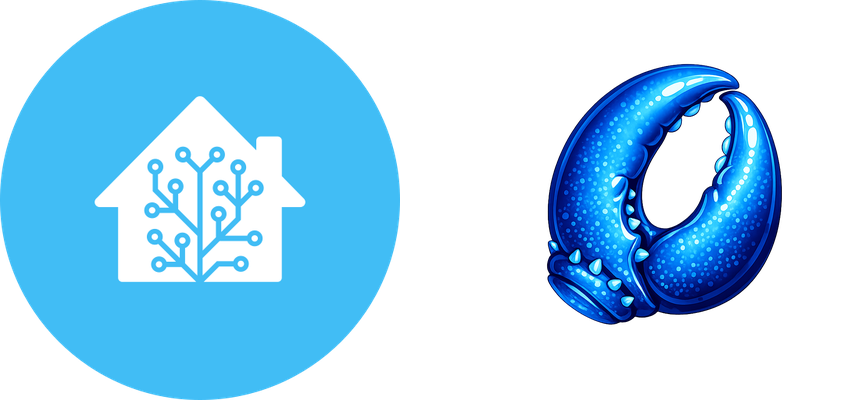

# ZeroClaw — Home Assistant Add-on

  

[ZeroClaw](https://github.com/zeroclaw-labs/zeroclaw) is a self-hosted AI
agent — think of it as an assistant that actually lives on your own
hardware, works with whichever AI provider you prefer, and can be taught to
do real things instead of just chatting. This add-on packages it up so it
runs right alongside the rest of your Home Assistant setup: no separate
server to maintain, no Docker commands to remember, just install it like
any other add-on and it's there.

Once it's running, it can see and control your smart home. It gets its own
dashboard for chatting with it, watching what it remembers, and tweaking
how it behaves, reachable straight from the Home Assistant sidebar — no
extra login, no port forwarding. And paired with its companion
integration, it can become the voice behind Home Assistant's own Assist,
so you can just talk to it.

## What it can do

- **Runs itself** — install, start, done. It boots, configures itself, and
  stays out of the way.
- **Comes with a built-in dashboard**, opened straight from the Home
  Assistant sidebar, where you chat with it, see what it's learned, manage
  scheduled tasks, and pick which AI provider powers it.
- **Sees and controls your home**, once you give it access via Home
  Assistant's MCP Server integration — lights, climate, locks, whatever
  you've set up in Home Assistant.
- **Can become your voice assistant** — paired with the companion
  [`zeroclaw_conversation`](https://github.com/LorenzoVasi/ha-zeroclaw-conversation)
  integration, it takes over Home Assistant's Assist so you can talk to it
  directly, by text or by voice.

## Requirements

- Home Assistant's own
  [MCP Server](https://www.home-assistant.io/integrations/mcp_server/)
  integration, installed and enabled (**Settings → Devices & Services →
  Add Integration → MCP Server**). This is what actually lets ZeroClaw see
  and control your home — without it, ZeroClaw has nothing to connect to
  no matter what token you give it.

## Install

1. In Home Assistant: **Settings → Add-ons → Add-on Store → ⋮ → Repositories**,
   add this repository's URL.
2. Install **ZeroClaw**, open its **Configuration** tab, and set an
   `api_token` — any random string works, just reuse the same one later
   when setting up the `zeroclaw_conversation` integration.
3. Make sure the **MCP Server** integration (see Requirements above) is
   set up, then paste in a Home Assistant
   [long-lived access token](https://www.home-assistant.io/docs/authentication/#your-account-profile)
   so ZeroClaw already knows how to reach your home the moment it starts.
4. Start the add-on and open its **Web UI** from the sidebar — that's
   where you actually finish setting it up: pick an AI provider, paste its
   key, and you're ready to go. This add-on deliberately doesn't duplicate
   that configuration screen; everything beyond the basics happens inside
   ZeroClaw itself.
5. (Optional) Install the
   [`zeroclaw_conversation`](https://github.com/LorenzoVasi/ha-zeroclaw-conversation)
   integration to plug ZeroClaw into Assist.

Full walkthrough: [DOCS.md](DOCS.md).

## Why so few options here?

ZeroClaw already comes with its own full settings screen (reachable right
from this add-on's dashboard), so there's no point recreating a second,
easily out-of-sync copy of it as Home Assistant add-on options. What lives
here is just enough to get ZeroClaw up, reachable, and reasonably locked
down — everything else (which AI provider to use, what agents exist, how
cautious they should be) is a live setting inside ZeroClaw's own
dashboard, and it's kept safely across add-on restarts and updates.

## Built with agentic AI development

This add-on — and its companion integration — were built through agentic
AI development: multiple coordinated Claude Code agents doing the actual
research, coding, and testing, with a human checking real behavior against
a running instance before trusting any of it. Every decision made along
the way, including the mistakes and the dead ends, is logged in
[`docs/DECISIONS.md`](docs/DECISIONS.md) for anyone curious how it actually
came together.

## Architectures

`amd64`, `aarch64` — matches ZeroClaw's own published multi-arch images.

## License

This repository is MIT-licensed (see [LICENSE](LICENSE)). It builds on top of
ZeroClaw's own published container images; ZeroClaw itself is licensed
separately by ZeroClaw Labs (Apache-2.0 OR MIT).
